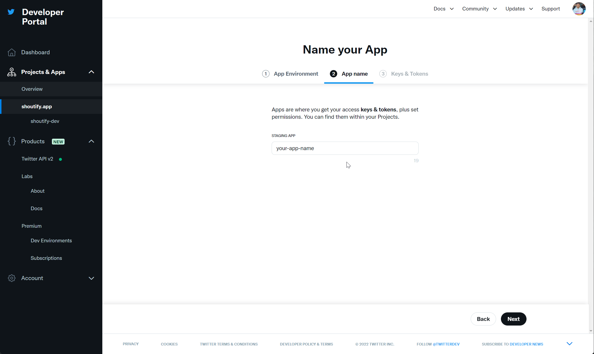
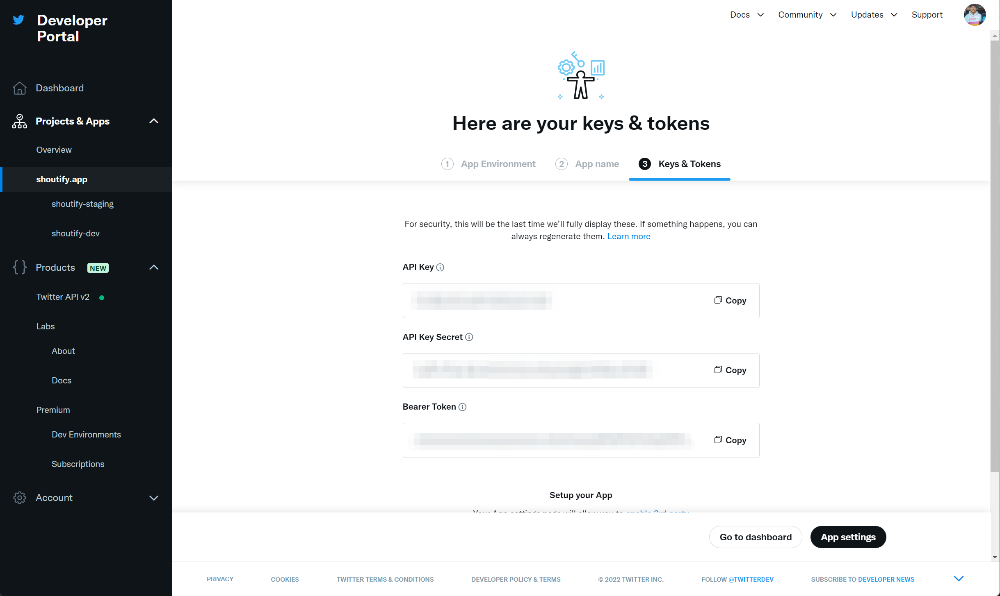
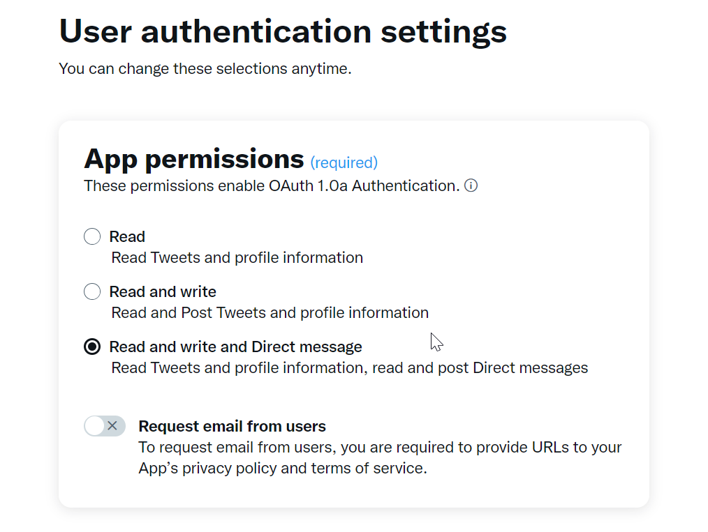
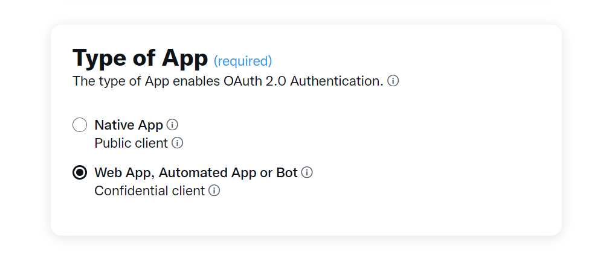
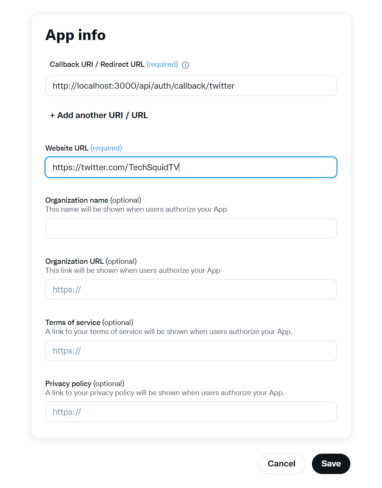

# Configure Twitter For Shoutify

In order to use or develop for Shoutify, you'll need a Twitter Developer Account, and an app with appropriate permissions for authentication, and posting on your behalf.

1. Go to the [Twitter Developer Portal](https://developer.twitter.com/en/docs/developer-portal/overview) and sign up for a developer account.
2. When logged into the Developer Portal, click on [Projects & Apps](https://developer.twitter.com/en/portal/projects-and-apps) in the left sidebar.

3. Click on the "Create an app" button.
  

4. Give your app any name you want, and continue on to next step to obtain your API keys.
  

5. Take note of the API key and API secret key, as you will need them later.

6. Continue on to "App Settings" by clicking the button on the bottom right.

7. From the app settings page, near the bottom click the "Edit" button next to _"User authentication setup"_.

8. Currently, you will only have "Read Only" access. After hitting the edit button, select the permissions to allow "Read + Write + Direct Messages" access.
  

9. Next on the page, under _"Type of App"_, select _"Web App, Automated App or Bot", a.k.a "Confidential client"_
  

10. In the last section, under "App info", you will need to add your callback URL and website.
  
    **Callback URL**: `http://localhost:3000/api/auth/callback/twitter`

    **Website**: Anything, but it must be a valid URL. Your own twitter account will work.

11. When complete, click "Save" at the bottom of the page.

12. Finally, after saving, you will be shown a screen with your Client ID and Client Secret for OAuth 2.0. Save these values for the rest of the [project setup](./HACKING.md#repository-setup).
