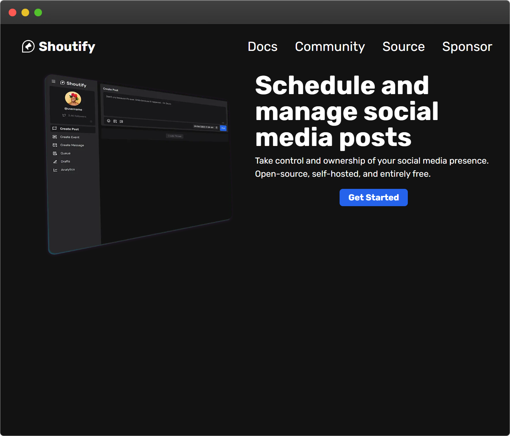
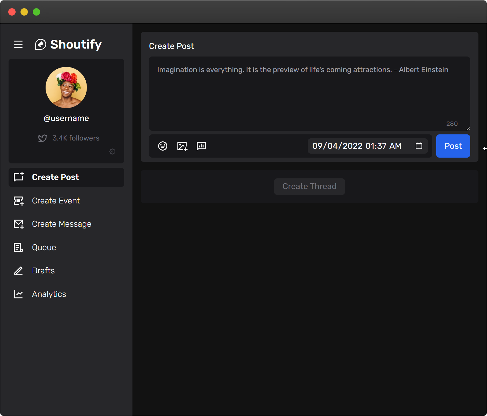

  

An open source, self-hosted, and entirely free solution to social media management.

---

## Status

🚧 **In Development** 🚧

Shoutify is currently _early_ in the development cycle. This app is not yet
functional but is being actively developed. Please "watch" the project and leave
a star to get all updates.

## Description

Shoutify is a social media management tool that allows you to manage and
schedule posts across multiple social media platforms. Shoutify was built to
empower individual content creators and small businesses to take control and
ownership of their social media presence.

## Features

- Post to multiple social media platforms at once (Twitter, more coming soon)
- Schedule posts and Twitter threads to be published at a later time
- Schedule, manage, and share events like Twitter Spaces
- Schedule and manage direct messages
  - Setup mailing lists

  
 

## Development

To setup and install Shoutify for development, please read the
[HACKING.md](.github/HACKING.md) document.

### Contributing

Shoutify is an open-source project and we welcome contributions from the
community. Please read our [contributing guidelines](./.github/CONTRIBUTING.md)
to learn how you can get involved.

Shoutify is built with [create-t3-app](https://github.com/t3-oss/create-t3-app)
and the [T3 stack](https://init.tips/), which utilizes:

- [TypeScript](https://www.typescriptlang.org/)
- [Next.js](https://nextjs.org/)
- [Tailwind CSS](https://tailwindcss.com/)
- [Prisma](https://www.prisma.io/)
- [tRPC](https://trpc.io/)

## Support

Shoutify is an Apache-2.0 license open-source project. The continued development
of this project is thanks to the goodwill of our contributors and generous
backers.

At this time, Shoutify is _not accepting donations or backers_.

### Community

Join the TechSquidTV Discord server to chat with like-minded developers and
discuss Shoutify.

